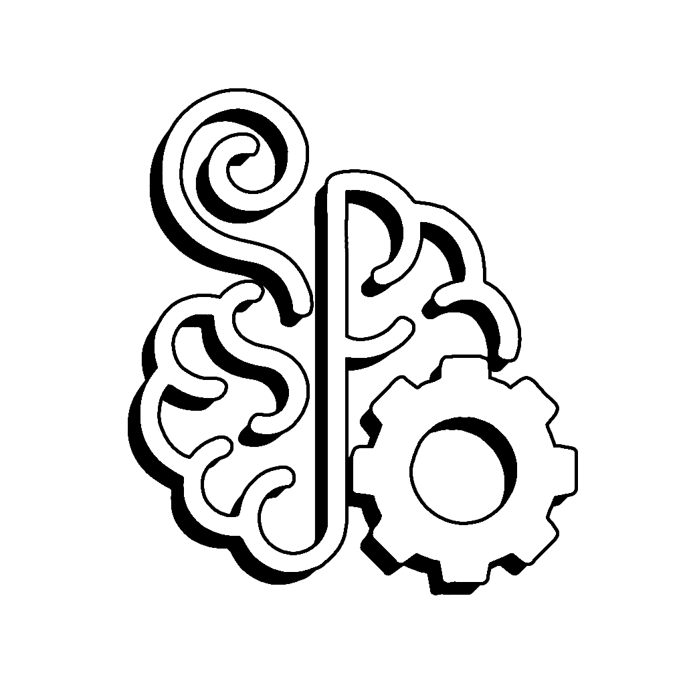

<h1 align="center">Hey 👋, I'm Emko.</h1>

<h2 align="center">
  Founder of  
  <a href="https://github.com/Ecstasys-Development" target="_blank" style="text-decoration: none; color: inherit;">
    
    Ecstasys Development
  </a>
</h2>

---

  🔧 Full Stack Developer | 🎮 FiveM Scripter | 🎨 UI/UX Designer | 💻 A bit of software developer

  

---

## 💻 Tech Stack

<!-- 🌐 Web -->

  <table>
    <tr>
      <td>
        

          <b>🌐 Web</b>  
          
 
            
          

        

      </td>
    </tr>
  </table>

<!-- 🛠️ FiveM -->

  <table>
    <tr>
      <td>
        

          <b>🛠️ FiveM</b>  
          
 
            
          

        

      </td>
    </tr>
  </table>

<!-- 🎮 Game Dev -->

  <table>
    <tr>
      <td>
        

          <b>🎮 Game Dev</b>  
          
 
            
          

        

      </td>
    </tr>
  </table>

<!-- 💻 Software Dev -->

  <table>
    <tr>
      <td>
        

          <b>💻 Software Dev</b>  
          
          
          
          
        

      </td>
    </tr>
  </table>

<!-- 🎨 Tools -->

  <table>
    <tr>
      <td>
        

          <b>🎨 Tools</b>  
          
          
          
          
          
          
          
        

      </td>
    </tr>
  </table>

---

## 📊 GitHub Stats

  
  

<picture>
  <source media="(prefers-color-scheme: dark)" srcset="https://raw.githubusercontent.com/ecstasysdevelopment/ecstasysdevelopment/output/github-snake-dark.svg" />
  <source media="(prefers-color-scheme: light)" srcset="https://raw.githubusercontent.com/ecstasysdevelopment/ecstasysdevelopment/output/github-snake.svg" />
  
</picture>

---

## 🚀 Currently Working On

- 🎮 Some very advanced FiveM scripts for RP or also PVP servers
- 📊 A localhost dashboard for a Lego Spike car in Python and JS  
- 🧠 Advanced and very good UI/UX design for my FiveM scripts 
- 💡 Clean, modular & optimized scripts  

---

## 🤝 Connect with Me

- 💬 Discord: `emko.gfx`  
- 🌍 GitHub: [@ecstasysdevelopment](https://github.com/ecstasysdevelopment)

---

  

  ⭐️ If you like my work, consider starring a repo, please xd!

